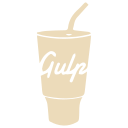
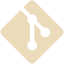

<h1 align="center">Hello, i'm Bae!</h1>

<h3>
  I am a Web and Front-end developer. I have three years of work experience. I'm  
  - responsible  
  - sociable  
  - an easy learner  
  - punctual  
  - strive for perfection  
</h3>
<h3 align="center">I will be glad to cooperate with you ♥.</h3>

 
<section>
  <h2 align="center">Languages & Tools</h2>
  

    
    
    
    
    
     
    
    
    
    
    
  

</section>
 

<h2>Contact Me</h2>

    
    
    
    </a>
    
    </a>

